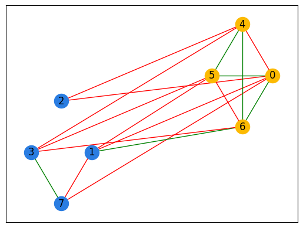

# Social Networks 

## Set Partitioning - Friends and Enemies Problem - SOLUTION

In the D-Wave training, I learned how to construct QUBOs that model friendly and
hostile relationships, and how we can sum up the relationships 
in a social network to model the network. When we solve this problem on
a D-Wave solver, the solution partitions the graph into two sets such that the 
number of hostile relationships within a set is minimized. 

In this exercise, I constructed a QUBO and BQM for arbitrarily sized social networks
and solved these networks on both a QPU and BQM hybrid solver. We also 
explore the limit of the QPU solver to see why the hybrid solvers are useful.

When the program is run, it generates three graphs. One shows the problem and
two display the solution. For example, if you construct a QUBO or BQM properly
for a 10 node graph, you may see something like this

where 
* red edges = hostile relationships
* green edges = friendly relationships
* black nodes = nodes in the problem 
* blue nodes = nodes in one group (set 0 in the solution)
* yellow nodes = nodes in the second group (set 1 in the solution)

A summary of the number of friendly and hostile edges in each set, as well as 
the friendly and hostile edges between sets (0-> 1), is also printed out in the command line.
For example, the output below shows that there are 3 friendly and 9 hostile edges between sets
0 and 1, as you can see in the images above. 

As a reminder the QUBOs for each relationship are as follows.

Friendly relationship:

Hostile relationship:

       

## Instructions:

There are two parts to this assignment.

### Exercise 1:  
In this exercise you will build a QUBO for the friends and enemies problem on a random
graph. The QUBO will be submitted to the QPU. Feel free to experiment
 with the size of the graph and remember to make your code scalable so you don't have to
 rewrite the QUBO for every new graph. It's worth noting that the EmbeddingComposite can
 take a few minutes to find an embedding for really big graphs.
  
 Open up the `friends_enemies_qpu.py` file. You will need to
 
1. Construct the QUBO for the friends and enemies problem .
2. Run the problem on the QPU.

Hint:  
* Use random.choice() to randomly assign a friendly or hostile relationship to an edge

### Solution `friends_enemies_qpu_solution.py`

For a 5 node graph, the terminal output is as follows:

            Set       Friendly    Hostile    

              0              0       0       
              1              2       0       
         0 -> 1              0       3    

Problem

Solution

Partitioned Solution

---

For a 8 node graph, the terminal output is as follows:

            Set       Friendly    Hostile    

              0              1       1       
              1              4       2       
         0 -> 1              1       8        

Problem

Solution

Partitioned Solution

---

For a 10 node graph, the terminal output is as follows:

            Set       Friendly    Hostile    

              0              4       1       
              1              3       3       
         0 -> 1              2      13           

Problem

Solution

Partitioned Solution

---

For a 20 node graph, the terminal output is as follows:

            Set       Friendly    Hostile    

              0             19       6       
              1             21       5       
         0 -> 1             19      45           

Problem

Solution

Partitioned Solution

---

For a 100 node graph, the terminal output is as follows:

            Set       Friendly    Hostile    

              0            426      321      
              1            434      288      
         0 -> 1            604      949            

Problem

Solution

Partitioned Solution

---
    
### Exercise 2:  
In this exercise you will build a BQM for the friends and enemies problem on a random graph.
This time you will submit the problem to the BQM hybrid solver. Although the work you did
in exercise 1 will come in handy, pay close attention to the differences between a dictionary
and the BinaryQuadraticModel you're asked to create. 

Open up the `friends_enemies_hybrid.py` file. You will need to

1. Create a graph that's too large to run on the QPU.
2. Construct a BQM for the friends and enemies problem. 
3. Run the problem on the hybrid sampler.

Hint:  
* Use random.choice() to randomly assign a friendly or hostile relationship to an edge

### Solution `friends_enemies_hybrid_solution.py`

For a 100 node graph, the terminal output is as follows:

            Set       Friendly    Hostile    
            
              0            446      278      
              1            435      311      
         0 -> 1            608      883   

Problem

Solution

Partitioned Solution

---

For a 400 node graph, the terminal output is as follows:

            Set       Friendly    Hostile    

              0           6170     5051      
              1           6869     5755      
         0 -> 1          10775     13130 

Problem

Solution

Partitioned Solution

NOTE: For 400 nodes, QPU takes a lot more time than Hybrid solver. I wasn't able to get any results for 400 nodes graph via a QPU. 

---

#### Resources
1. Ocean documentation: https://docs.ocean.dwavesys.com/en/latest/index.html
2. BQM documentation: https://docs.ocean.dwavesys.com/en/stable/docs_dimod/reference/quadratic.html#binary-quadratic-models
3. Random python module: https://docs.python.org/3/library/random.html
4. How to use the timeout parameter with the embedding tools: 
https://support.dwavesys.com/hc/en-us/community/posts/360052799433/comments/1500000168162
5. Maximum cut code example: https://github.com/dwave-examples/maximum-cut

## License

Released under the Apache License 2.0. See [LICENSE](LICENSE) file.
